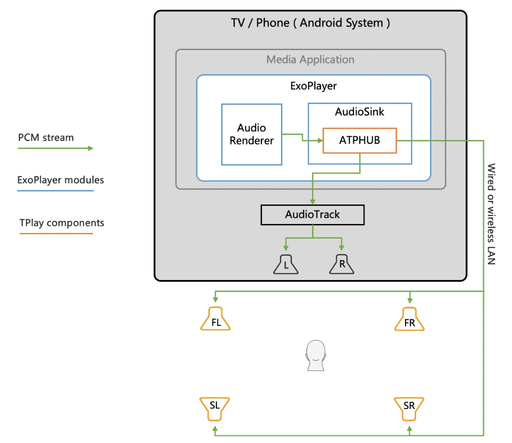

# ExoPlayer-OnGo

ExoPlayer is an application level open-source media player for Android. It provides an alternative to Android’s MediaPlayer API for playing audio and video.

ExoPlayer-OnGo is based on ExoPlayer (release-v2-r2.18.7), which can synchronize stereo or 5.1 surround audio to multiple external speakers in real time. The playback device and external speakers form a surround sound system around the audience, creating a multidirectional audio field that mimics real-life sound environments.

## Implementation Overview

Between the audio renderer and the audio track is the audio sink that consumes the audio data(PCM). The core functionality of ATPHUB is embedded in the handleBuffer of DefaultAudioSink, which is used to intercept, mix and forward audio data. 

The ATPHUB is a user space library of TPlay ported to Android, including higher-level APIs and a background service(thread-based). 

As the hub-side module of TPlay, the ATPHUB processes the intercepted audio data to apply different mixing strategies, and then synchronously forwards the data to device speakers and remote external speakers with built-in TPlay.

TPlay is a lightweight wireless surround sound solution that provides channel-based mixing, delay, equalization, wireless synchronization and other related technical implementations.  

## Using ExoPlayer-OnGo

Please refer to the original ExoPlayer README at 
[Exoplayer 2.18.7](https://github.com/DepthCoreTech/ExoPlayer-OnGo/blob/master/README-ORIGINAL.md) 
for the usage instructions of ExoPlayer.

In addition to exoplayer, some other ATPHUB APIs also need to be called by the application to initialize, configure, start, etc.

There is a complete application that demonstrates how to use Exoplayer-OnGo.  
See repository: https://github.com/DepthCoreTech/OngoPlayer

## Contact

Please feel free to contact us via email: [depthcoretech@163.com](mailto:depthcoretech@163.com)
